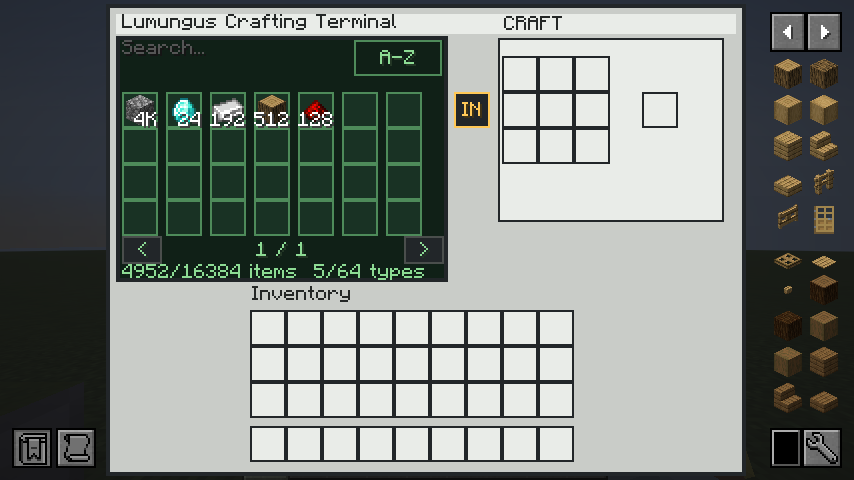

# UAT Results 0.1.0-uat.3

Gesamtstatus: `AUTOMATED_CLIENT_PASS`

Der Coding-, Server- und automatisierte Client-UAT ist bestanden. Manuelle Interaktions- und Multiplayer-Schritte bleiben vor einer oeffentlichen Freigabe offen.

## Build

- Java: Temurin `25.0.4.1`
- Kommando: `./gradlew clean build storageUatBundle --console=plain`
- Ergebnis: `PASS`
- JUnit: 11 von 11 Tests bestanden
- Server-GameTests: 4 von 4 Tests bestanden
- Client-GameTests: 1 von 1 Test bestanden
- Bundle: `build/uat/lumungus-storage-0.1.0-uat.3.zip`

`storageUatBundle` ist jetzt an die Core- und Storage-Checks gekoppelt. Ein Kandidat mit roten Tests kann nicht mehr erfolgreich paketiert werden.

## Behobene Befunde

- `UAT-04/UAT-17`: Drive Bays speichern Controller-Position und Netzwerk-ID. Ein naeher platzierter Controller uebernimmt keine bereits gebundene Bay. Nach tatsaechlicher Entfernung des Besitzers erfolgt eine kontrollierte Neuzuordnung ohne Verlust des Cell-Inhalts.
- `UAT-13/UAT-15`: Der Zutatenplaner verwendet Backtracking fuer mehrdeutige Rezepte und veraendert den angebotenen Ressourcenpool nicht.
- `UAT-14`: Nicht verschobene Shift-Craft-Ergebnisse bleiben im Result-Slot oder werden wie bei Vanilla kontrolliert gedroppt. Ein GameTest prueft die Gesamtmenge bei fast vollem Inventar und sofortigem Folge-Craft.
- `UAT-15/UAT-16/UAT-18`: Ein fehlgeschlagener Rezepttransfer laesst ein bestehendes Grid unveraendert. Dies ist mit einem echten Server-Spieler und geladenen BlockEntities geprueft.
- `UAT-19/UAT-20`: Ein Terminal ohne erreichbaren Controller verursacht beim Broadcast keine NullPointerException mehr.
- `PERF-01`: Netzwerkzustand wird in einem Durchlauf zusammengefasst und pro Spieltick gecacht. Persistente Bay-Links vermeiden verschachtelte Vollscans bei jedem Zugriff.

## Automatisierter Client-UAT

Der offizielle Fabric Client GameTest startet Minecraft 26.2 mit Fabric API, JEI, Lumungus Core und Lumungus Storage `0.1.0-uat.3`. Er erstellt selbststaendig eine Einzelspielerwelt, baut Controller, Drive Bay und Crafting Terminal auf, setzt eine 16k Cell ein und befuellt das Netzwerk mit fuenf Materialtypen. Anschliessend oeffnet er das echte Terminal serverseitig, wartet auf die vollstaendige Client-Synchronisation und erzeugt einen Screenshot.

- Kommando: `./gradlew :lumungus-storage:runClientGameTest`
- Ergebnis: `PASS`
- Screenshot-Serie: `modules/lumungus-storage/build/run/clientGameTest/screenshots/*lumungus-storage-terminal-uat3-*.png`
- Geprueft: Clientstart, Weltbeitritt, Block-/Menue-Registrierung, Netzwerk-Synchronisation, Terminal-Rendering und gleichzeitige JEI-Darstellung

Der erste visuelle Lauf zeigte zu eng stehende Mengenangaben. Das Ressourcenraster wurde auf sieben Spalten mit groesserem Abstand umgestellt; Mengen ab 1.000 werden kompakt mit `K` dargestellt. Der abschliessende Lauf zeigt getrennte Materialfelder, korrekte Summen und keine ueberlappenden Bedienelemente. Da einzelne GPU-Readbacks unter Minecraft 26.2 sporadisch unvollstaendige Glyphen enthalten, erzeugt der Test fuenf zeitversetzte Bilder fuer die visuelle Kontrolle.

Die fruehere externe Desktop-Automation bleibt wegen eines nativen `glfw.dll`-Absturzes ungeeignet. Der Client GameTest umgeht diese externe Fensteraktivierung und beendet sich reproduzierbar selbst.

## Noch offen

- Manuelle Bedienung von Suche, Sortierung und Seitenwechsel
- Manueller JEI-Button-Transfer im Client
- Speichern, kompletter Client-Neustart und erneutes Laden der Testwelt
- Gleichzeitiger Zugriff mit zwei echten Spielern

Eine oeffentliche Release-Freigabe erfolgt erst, wenn diese Schritte ebenfalls `PASS` sind.
